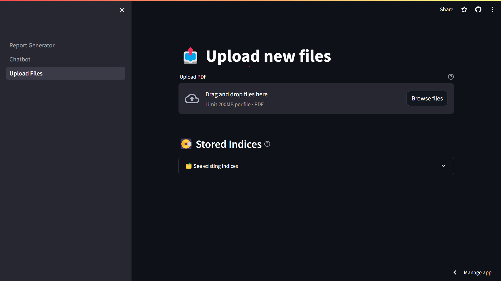
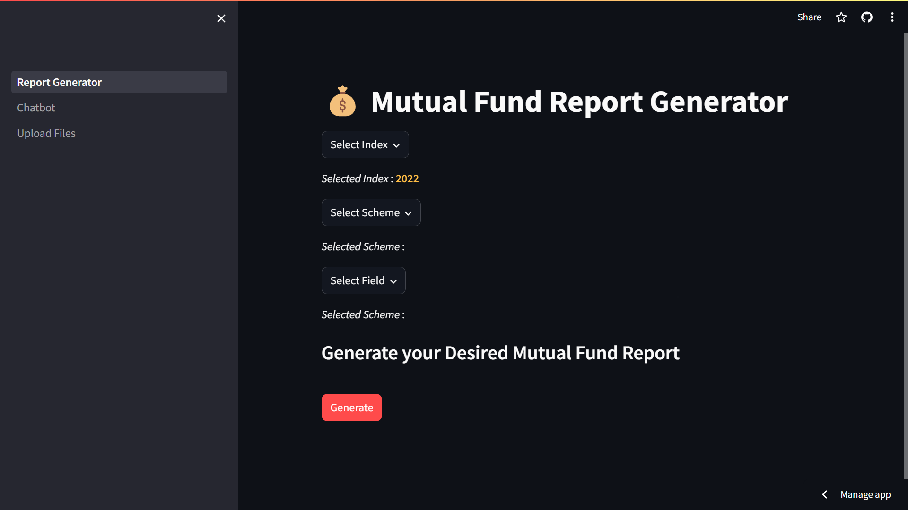
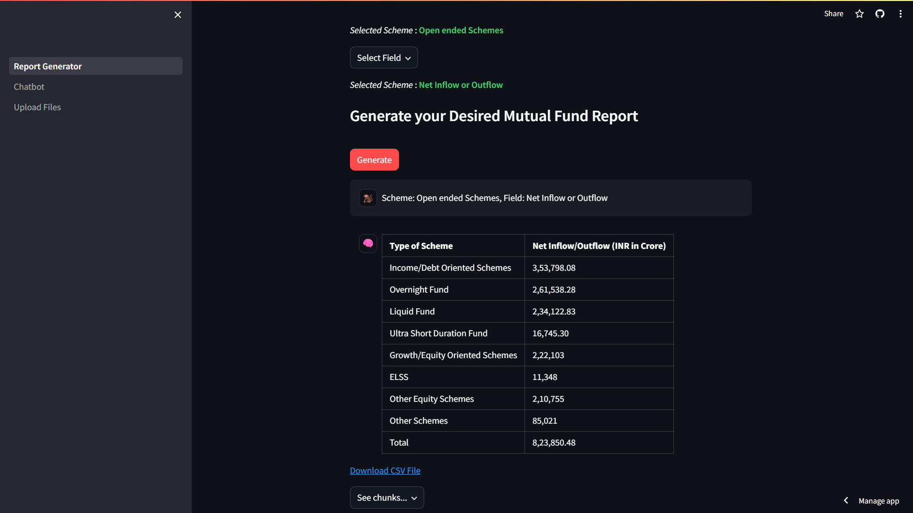
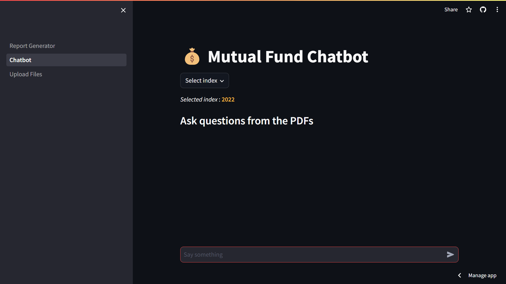

# 💰 Basic-RAG-MutualFund-Report-Generator-and-Chatbot

[](https://choosealicense.com/licenses/mit/)
 
This is a basic RAG chatbot and report generator made using LangChain, Streamlit, FAISS, Cohere's embed-english-v3.0 and Cohere's command-r

The project is deployed on streamlit. Visit and try from this [link](https://chatfunds.streamlit.app/).

## Features and Functionalities
- You can upload multiple reports as PDF.
- Multiple indices can be added for better organization
- You can select more than one `schemes` and `fields` as input
- Generated report can be downloaded locally in CSV format for future references.
- For development purposes, you can see the chunks retrieved from the vector database for the specific query
- *Additional Feature* : There is a Chatbot as an option to generate your own personalized queries.

## Tech Stack
- Language : `Python`
- Libraries and Frameworks : `LangChain`, `PyPdf`, `Tabula`, `Streamlit`, `Pandas`
- Models: Cohere's `embed-english-v3.0` and `command-r`
- Database: `FAISS` Vector Database

## Setup on Local Machine

Worked with Python 3.11 anything above will probably work.

1. Clone the repo

 ```sh
 git clone https://github.com/jojocoder28/Mutual_Fund_Chatbot
 ```
 ---
2. Create and activate virtual environment
```sh
cd Mutual_Fund_Chatbot
python -m venv .venv
.venv\Scripts\activate
```
---
 3. Install Requirements

 ```sh
pip install -r requirements.txt
```
---

4. For the local machine you need to uncomment the import tabula and tabula.convert_into(uploaded_file[0], f"db/{index_name}/table.csv",pages='all', output_format='csv') in the 141st line of pages/Upload_Files.py

---

5. Create a .env file and put your [Cohere API Key](https://dashboard.cohere.com/api-keys) as COHERE_API_KEY and OpenAI API key as OPENAI_API_KEY

```sh
COHERE_API_KEY=[YOUR COHERE API KEY GOES HERE]
```

The chatbot uses Cohere's embed-english-v3.0 and command-r by default.

##
6. Run Chatbot.py

```sh
streamlit run .\Report_Generator.py
```

---
## Use

- Navigate to **Upload Files** in the sidebar to upload your own PDFs (make sure the PDFs are readable)
#

#
- Store the uploaded PDFs in a new or existing index.
- Navigate to **Report Generator** and select the desired index (An index for the year 2022 is already created).
- Select your scheme from the drop-down menu, or search in the search box
#

#
- Select the fields on which you want to generate a report on from the `Field` drop-down menu.
- Click on `Generate`. The report from your query will be generated in a tabular form.
#

#
- You can download the generated report in CSV format from the `Download CSV File` link.
- You can also use the Chatbot
#
 
 #
- If you want to know the what chunks were sent to the llm to generate the report, click on the `see chunks...` drop down.


## Contributors

- [Swarnadeep Das](https://github.com/jojocoder28)
- [Sukanta Bala](https://github.com/su1nta) 
- [Areej Aasna](https://github.com/areejaasna) 
